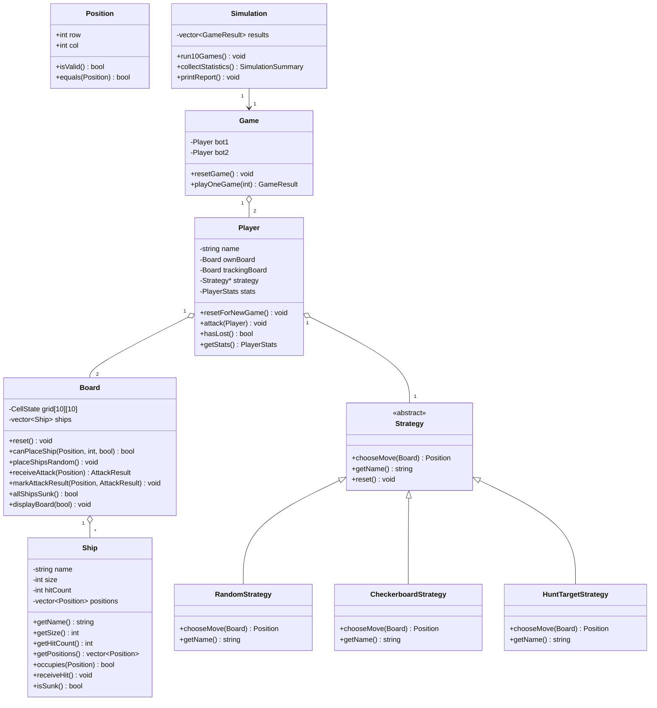

# Mini Project C++ OOP: BattleShip Console

## 1. Y tuong

Project mo phong BattleShip bang C++ console. Moi bot co mot ban tau rieng va mot ban theo doi doi thu. Tau duoc dat ngau nhien hop le tren ban 10x10, khong chong len nhau, nam ngang hoac doc.

Trong moi luot, `Player` khong tu quyet dinh cach ban. `Player` chi goi:

```cpp
strategy->chooseMove(trackingBoard);
```

Nho vay, co the thay chien thuat bang `RandomStrategy`, `CheckerboardStrategy` hoac `HuntTargetStrategy` ma khong can sua logic cua `Game`.

## 2. Class diagram



## 3. Cach chay

Neu may co MinGW/g++:

```bash
g++ -std=c++11 main.cpp Ship.cpp Board.cpp Strategy.cpp Player.cpp Game.cpp Simulation.cpp -o battleship
./battleship
```

Tren Windows, file chay co the la:

```bash
battleship.exe
```

Neu dung Visual Studio Developer Command Prompt:

```bat
cl /EHsc /std:c++14 main.cpp Ship.cpp Board.cpp Strategy.cpp Player.cpp Game.cpp Simulation.cpp
main.exe
```

Trong `main.cpp`, co the doi chien thuat:

```cpp
Simulation simulation(StrategyType::Random, StrategyType::HuntTarget, 10);
```

## 4. Cac class duoc dung

- `Position`: luu toa do hang/cot.
- `Ship`: luu ten tau, kich thuoc, cac toa do cua tau va so lan bi ban trung.
- `Board`: quan ly mang 2 chieu 10x10, dat tau, nhan tan cong, kiem tra thang/thua.
- `Strategy`: lop cha truu tuong cho moi chien thuat bot.
- `RandomStrategy`: ban ngau nhien vao o chua ban.
- `CheckerboardStrategy`: uu tien ban vao cac o co `(row + col) % 2 == 0`.
- `HuntTargetStrategy`: Hunt bang checkerboard, sau khi HIT thi Target cac o tren/duoi/trai/phai va mo rong theo huong.
- `Player`: co ban tau rieng, ban theo doi doi thu, thong ke va con tro `Strategy*`.
- `Game`: dieu khien mot tran giua 2 bot.
- `Simulation`: chay 10 tran, thu thap thong ke va in bao cao.

## 5. OOP trong code

### Dong goi

Thuoc tinh quan trong deu de `private`, vi du:

- `Ship`: `name`, `size`, `hitCount`, `positions`.
- `Board`: `grid`, `ships`.
- `Player`: `ownBoard`, `trackingBoard`, `strategy`, `stats`.

Ben ngoai khong sua truc tiep du lieu noi bo ma phai thong qua ham nhu `receiveAttack()`, `isSunk()`, `attack()`, `getStats()`.

### Ke thua

Ba lop chien thuat ke thua tu `Strategy`:

```cpp
class RandomStrategy : public Strategy
class CheckerboardStrategy : public Strategy
class HuntTargetStrategy : public Strategy
```

### Da hinh

`Player` giu con tro:

```cpp
Strategy* strategy;
```

Khi can ban, `Player` chi goi:

```cpp
Position shot = strategy->chooseMove(trackingBoard);
```

Neu `strategy` dang tro den `RandomStrategy`, ham random duoc goi. Neu tro den `HuntTargetStrategy`, ham Hunt & Target duoc goi. `Player` khong can `if-else` de hoi bot dang dung chien thuat nao.

### Vi sao Strategy la vi du tot cua da hinh?

Vi tat ca chien thuat deu co cung hanh vi ben ngoai la `chooseMove()`, nhung cach thuc ben trong khac nhau. Day la tinh huong rat phu hop de dung abstract class/interface: cung mot loi goi, nhieu cach xu ly.

## 6. Phan tich chien thuat

### Random Strategy

- Cach choi: chon ngau nhien mot o chua ban.
- Tot nhat: may man ban trung lien tiep som.
- Te nhat: ban rai rac, sau khi HIT van tiep tuc random nen ton nhieu luot.
- Danh gia: de cai dat nhat nhung kem on dinh nhat.

### Checkerboard Strategy

- Cach choi: uu tien ban o mau caro `(row + col) % 2 == 0`.
- Tot nhat: tim tau nhanh hon Random vi tau nho nhat dai 2 o, nen tau thuong cham vao it nhat mot o trong mau caro.
- Te nhat: sau khi HIT khong tap trung danh chim, co the bo lo co hoi ket thuc tau nhanh.
- Danh gia: tot hon Random trong giai doan tim tau.

### Hunt & Target Strategy

- Cach choi: Hunt bang checkerboard. Khi HIT, ban 4 o xung quanh. Neu co nhieu HIT thang hang, mo rong theo cung huong.
- Tot nhat: sau khi tim thay tau, danh chim nhanh bang cach tap trung quanh vi tri HIT.
- Te nhat: neu HIT gan bien hoac cac huong xung quanh da bi ban truot, bot phai quay lai Hunt.
- Danh gia: thuong la chien thuat toi uu nhat trong 3 chien thuat vi ket hop tim kiem va ket thuc muc tieu.

## 7. Neu la nguoi choi: choi the nao toi uu?

Nen chia thanh 2 giai doan:

1. `Hunt`: ban theo mau caro de giam so o can thu.
2. `Target`: khi ban trung, dung lai viec ban lung tung. Hay ban tren, duoi, trai, phai. Neu co 2 o trung lien tiep, tiep tuc ban theo cung hang hoac cot de danh chim tau.

Cach nay giam so luot ban lang phi va tang kha nang danh chim tau nhanh.

## 8. Neu la chu/quan ly game: quan ly the nao toi uu?

Nen quan ly ro 3 nhom:

- Luat choi: dat tau hop le, khong chong tau, khong ban trung o, xac dinh HIT/MISS/SUNK, xac dinh thang thua.
- Mo phong: cho bot dau nhieu tran, doi nguoi di truoc de cong bang hon, reset ban moi moi tran.
- Thong ke: luu so tran thang, so luot ban, HIT, MISS, so tau danh chim, hit rate, average shots va win rate.

Khi danh gia chien thuat, khong nen chi nhin mot tran vi yeu to ngau nhien rat lon. Nen nhin nhieu tran va so sanh bang win rate, average shots va hit rate.

## 9. Ket luan goi y cho bao cao

Project da ap dung OOP de tach ro doi tuong trong BattleShip: tau, ban choi, nguoi choi, chien thuat, tran dau va mo phong. `Strategy` cho thay ro tinh da hinh: cung mot loi goi `chooseMove()` nhung moi chien thuat co cach chon nuoc di khac nhau.

Ve chien thuat, `Hunt & Target Strategy` thuong toi uu hon `Random Strategy` va `Checkerboard Strategy` vi sau khi ban trung, bot tap trung khai thac thong tin vua co de danh chim tau nhanh hon. `Checkerboard Strategy` tot cho giai doan tim tau, con `Random Strategy` don gian nhung kem on dinh.
